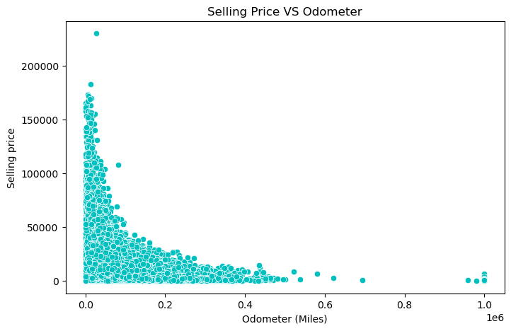

# Car-Price-Analysis
# 📌 PROJECT SUMMARY & INSIGHTS

1. Short Introduction

        This project anlysis car sales data to understand the key factors influencing car prices. Using Python and Data visualization techniques , we explore trends and based on brand ,milage, condition, and other features. The insights from this analysis can help buyers and seller make data-driven decisions.Taking insight full questions from that solving real-world problem to help user for making best decision.

2. Steps of Car Price Analysis:-

        1. Defining the Goal
        3. Get the Data
        4. Explore the Data
        5. Visualize the Data
        6. Summarize Findings

# 📌 INTRODUCTION OF STEPS OF ANALYZING

      ✅ Defining the Goal:-
             Goal: Analyze the factor affecting car prices.
             Dataset: Data set is take from Kaggle which contains car brand, model,  year,mileage, fuel type, price , etc

      ✅ Data cleaning:-
        ✍️ Quick checklist for Data Cleaning:
           1. Remove Duplicates
           2. Handle missing values
           3. Convert data types(if needed)
           4. Standarize column names
        
        ♦️Remove Duplicates:-
        why? Because Duplicate rows can lead to incorrect analysis by overrepresenting data 

        ♦️Handle missing values:
        Why? Missing values can affect calculations, so we either fill or remove them.

        ♦️Convert Data Types:
        Why? If numbers are stored as text (string), they need conversion.

        ♦️Standardize Column Names:
        Why? Column names should be easy to read and consistent.
     
      ✅ Exploratory Data Analysis (EDA):-
        ✍️ Quick checklist for EDA:-
           1. Check Basic Statistics
           2. Visualization Car Price Distribution
           3. Car Price vs Mileage
           4. verage Price by Brand
           5. rice Comparison by Car Condition

        ♦️ Check Basic Statistics
        why? summarizing of numerical columns, count the cars by brand , count of cars by body type
        
        ♦️ Visualization Car Price Distribution:
        Why? See the overall price range. which car is expensive or which is cheap 

        
